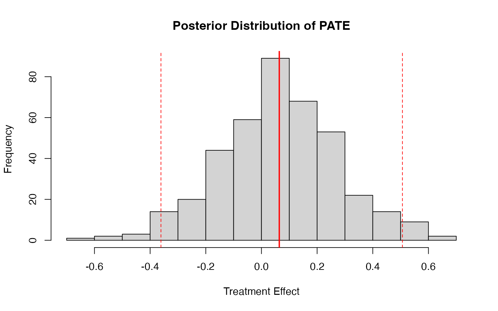
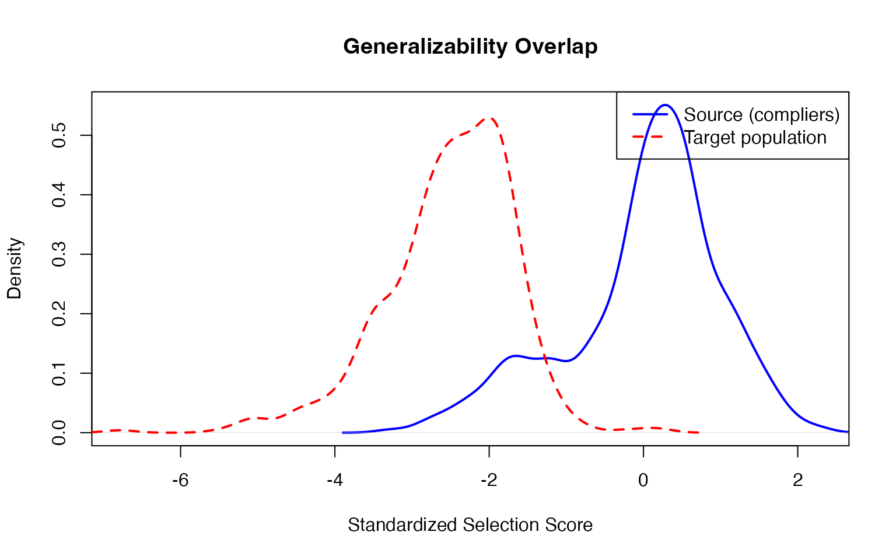
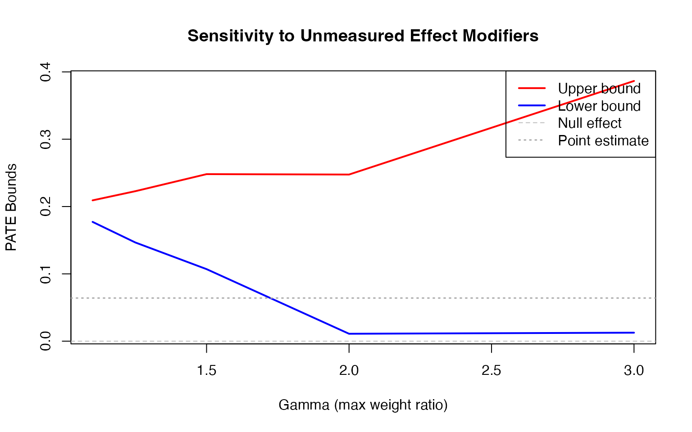

# Generalizing princeBART results to external populations

## Generalizing to External Populations

A key feature of princeBART is the ability to **generalize treatment
effects** to an external population using
[`general_BART()`](../reference/general_BART.md). This is useful when:

- You have a source study with detailed covariates and an instrument
- You want to estimate the Population Average Treatment Effect (PATE) in
  a larger target population (e.g., a nationally representative survey)
- The target population may be missing some covariates collected in the
  source

The key identifying assumptions are:

1.  **Conditional transportability**: The conditional treatment effect
    given X is the same in the source study and target population. That
    is, once we condition on observed covariates X, there are no
    remaining unmeasured effect modifiers that differ between the two in
    a way that changes the effect.

2.  **Included support**: Covariate profiles observed in the target
    population must be adequately represented in the source data.

### Simulating an External Population

Let’s simulate a large external “survey” population that: 1. Has
different covariate distributions than the source study 2. Is missing
the `income` variable (a common scenario with survey data) 3. Has
complex survey features (PSUs and weights)

``` r
library(princeBART)
set.seed(123)
n_external <- 500

# External population overlaps with source but shifts slightly
external_data <- data.frame(
  age = rnorm(n_external, 43, 11),        # Slightly older on average
  education = rnorm(n_external, 11.5, 3.5) # Slightly lower education
  # Note: income is NOT available in external data
)
# Survey design: 100 PSUs with varying sizes
external_data$psu <- sample(1:100, n_external, replace = TRUE)
external_data$weight <- runif(n_external, 0.5, 2)  # Survey weights

# Define a target subpopulation (e.g., adults under 60)
external_data$eligible <- external_data$age < 60
```

### Generalizing to the External Population

Now we use [`general_BART()`](../reference/general_BART.md) to: 1.
Auto-detect and multiply impute missing variables (e.g., `income`) using
BART 2. Compute instrument propensity e = P(Z\|X) as a feature expansion
3. Predict potential outcomes Y(0) and Y(1) for external units 4.
Estimate the PATE using Bayesian bootstrap for complex surveys

``` r
fit <- readRDS(system.file("extdata", "fit_intro.rds", package = "princeBART"))

# Generalize treatment effects to external population
# Missing variables are auto-detected and imputed
pate_result <- general_BART(
  princebart_fit = fit,
  newdata = external_data,
  subpop = external_data$eligible,       # Target subpopulation
  psu = external_data$psu,               # PSU for survey inference
  weights = external_data$weight,        # Survey weights
  n_cores = 4,
  verbose = TRUE
)

# View results
print(pate_result)

# saveRDS(pate_result, file = "inst/extdata/pate_result.rds")
```

The output shows: - **PATE**: The population average treatment effect
estimate - **95% CI**: Credible interval incorporating both posterior
and survey uncertainty - **N (subpop)**: Number of units in the target
subpopulation

The `general_pate` object stores all necessary information (predicted
outcomes, survey design, model components) for downstream sensitivity
analyses.

### Understanding the Output

``` r
pate_result <- readRDS(.extdata("pate_result.rds"))

# Detailed summary
summary(pate_result)
#> General BART PATE Summary
#> =========================
#> 
#> Treatment Effect Estimate:
#>   PATE:           0.0641 
#>   Posterior SD:   0.2135 
#>   95% CI:        [-0.3611, 0.5066]
#>   N (subpop):     465 
#> 
#> For sensitivity analyses, use:
#>   general_BART_overlap(object)      - Generalizability overlap
#>   general_BART_transportability(object)  - Weight-shift bounds

# Access posterior draws for custom analyses
hist(pate_result$draws,
     main = "Posterior Distribution of PATE",
     xlab = "Treatment Effect")
abline(v = pate_result$pate, col = "red", lwd = 2)
abline(v = pate_result$ci, col = "red", lty = 2)
```



### Assessing the Support Assumption: Overlap Diagnostics

One key threat to valid generalization is **lack of included
support**—if target covariate profiles are poorly represented in the
source data, results may depend on extrapolation into under-represented
regions of covariate space. To assess this, use
[`general_BART_overlap()`](../reference/general_BART_overlap.md) to
compute the **generalizability overlap score**:

``` math
s = P(\text{complier}|X, \text{in source}) \times P(\text{in source}|X)
```

This measures how similar external units are to compliers in the source
study and whether their covariate profiles are well-represented in the
source.

For binary uptake fits, this is exactly the complier-based overlap
diagnostic. For ordinal uptake fits, princeBART uses an affected-unit
analogue $`W(0)-W(1)=1`$; this ordinal overlap diagnostic is currently
experimental.

``` r
# Compute overlap scores from the fitted general_pate object
overlap <- general_BART_overlap(
  object = pate_result,
  verbose = TRUE
)
```

``` r
overlap <- readRDS(.extdata("overlap_result.rds"))

# View overlap metrics
head(overlap$overlap)
#>        pi_c      pi_t       pi_s e_s_tilde
#> 1 0.5033078 0.3320551 0.16712592 -2.017992
#> 2 0.4488438 0.2074929 0.09313190 -2.693049
#> 3 0.7593993 0.3066742 0.23288821 -1.600709
#> 4 0.6001259 0.2628247 0.15772787 -2.087626
#> 5 0.3569716 0.1845658 0.06588474 -3.071685
#> 6 0.6501027 0.1296895 0.08431150 -2.803076

# Plot overlap diagnostics
plot_overlap(overlap)
```



The overlap plot shows the distribution of selection scores for: -
Source study compliers (blue) - Target population units (red)

Good overlap means the distributions substantially overlap.

For ordinal uptake fits, this diagnostic uses an affected-unit analogue
$`W(0)-W(1)=1`$ in place of binary compliers and should be treated as
experimental.

#### Conservative Support Sensitivity Check

If some target-population units have covariate profiles poorly
represented in the source, you can assess sensitivity by recomputing the
PATE under a conservative assumption for those units. This tests whether
conclusions depend heavily on extrapolation:

``` r
# Identify and conservatively adjust for poorly supported target units
# Set treatment effect to zero for units with |e_s_tilde| > 2 (standardized score)
overlap_trimmed <- general_BART_overlap(
  object = pate_result,
  threshold = 2,           # Standardized score threshold
  overlap_value = "zero",  # Conservative: assume tau = 0 for poorly supported units
  verbose = TRUE
)
```

``` r
overlap_trimmed <- readRDS(.extdata("overlap_trimmed_result.rds"))

# Compare conservative PATE vs original
cat("Original PATE (all units):", round(pate_result$pate, 4), "\n")
#> Original PATE (all units): 0.0641
cat("Conservative PATE (unsupported → 0):", round(overlap_trimmed$pate_trimmed, 4), "\n")
#> Conservative PATE (unsupported → 0): 0.0333
cat("Units with weak support:", overlap_trimmed$n_trimmed, "\n")
#> Units with weak support: 382
```

### Sensitivity Analysis for Transportability

Even with good overlap/support, the source and target populations may
differ in **unmeasured effect modifiers**—covariates not captured in X.
To assess sensitivity to this violation of conditional transportability,
use
[`general_BART_transportability()`](../reference/general_BART_transportability.md)
for a bounded weight-shift sensitivity analysis. This computes bounds on
the PATE under the assumption that an unobserved effect modifier differs
between populations by a specified amount.

Run the sensitivity analysis across a range of gamma values to produce a
sensitivity curve. This shows how robust the PATE is to unmeasured
effect modification across source-target differences of varying
severity:

``` r
# Sensitivity curve for multiple gamma values
gammas <- c(1.1, 1.25, 1.5, 2, 3)
sens_results <- lapply(gammas, function(g) {
  general_BART_transportability(pate_result, gamma = g)
})
```

``` r
sens_results <- readRDS(.extdata("sensitivity_curve_results.rds"))

gammas <- c(1.1, 1.25, 1.5, 2, 3)
# Extract bounds
lower_bounds <- sapply(sens_results, function(x) x$lower$estimate)
upper_bounds <- sapply(sens_results, function(x) x$upper$estimate)

# Plot sensitivity curve
plot(gammas, upper_bounds, type = "l", col = "red", lwd = 2,
     ylim = range(c(lower_bounds, upper_bounds)),
     xlab = "Gamma (max weight ratio)", ylab = "PATE Bounds", 
     main = "Sensitivity to Unmeasured Effect Modifiers")
lines(gammas, lower_bounds, col = "blue", lwd = 2)
abline(h = 0, lty = 2, col = "gray")
abline(h = pate_result$pate, lty = 3, col = "dark gray", lwd = 1.5)
legend("topright", c("Upper bound", "Lower bound", "Null effect", "Point estimate"), 
       col = c("red", "blue", "gray", "dark gray"), lty = c(1, 1, 2, 3), lwd = c(2, 2, 1, 1.5))
```



### Summary: Two Robustness Checks for Generalization

The vignette has illustrated two distinct robustness checks that address
the two key identifying assumptions:

**Support Sensitivity Check** (via overlap diagnostics and conservative
adjustment) - **Assumption tested**: Included support - **Question**:
Are we extrapolating into covariate regions poorly represented in the
source? - **Evidence**: Threshold selected based on standardized
selection score; PATE recomputed assuming zero effect for poorly
supported target units - **Interpretation**: Large drop in PATE suggests
strong dependence on extrapolation; modest drop suggests robustness to
extrapolation risk

**Transportability Sensitivity Check** (via weight-shift bounds) -
**Assumption tested**: Conditional transportability - **Question**: How
large would source-target differences in unmeasured effect modifiers
need to be to materially change the PATE? - **Evidence**: Sensitivity
curve showing PATE bounds across increasing values of gamma (maximum
weight ratio) - **Interpretation**: If bounds remain tight across large
gamma values and/or exclude zero, results are robust to unmeasured
effect modification; if bounds widen dramatically or cross zero at small
gamma, findings are fragile

Both checks are valuable for a complete assessment of generalizability.
