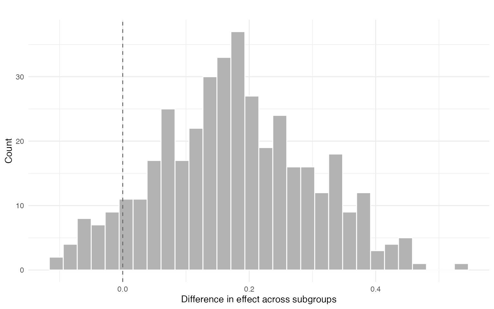
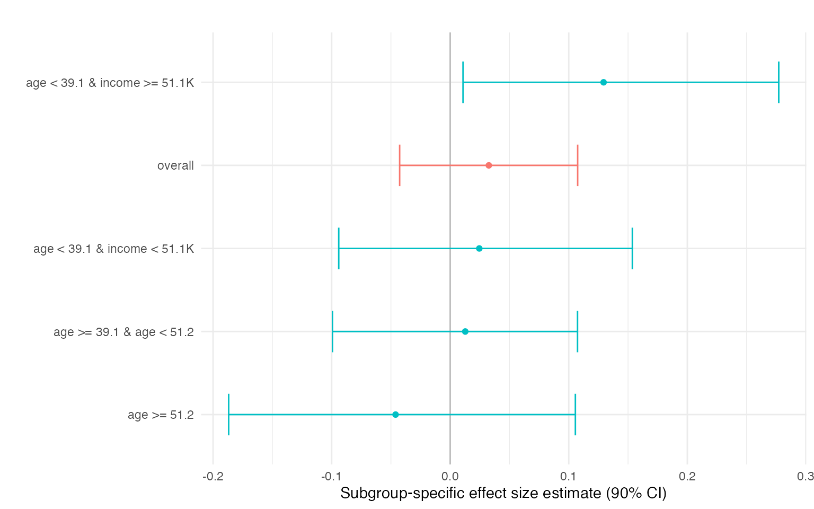

# Introduction to princeBART

## Overview

princeBART implements **Principal Stratification with Bayesian Additive
Regression Trees (BART)** for causal inference with endogenous
treatments. It estimates treatment effects for compliers—units whose
treatment status is affected by an instrument.

While the canonical application is noncompliance in randomized
experiments, the framework applies broadly to any setting with:

- An **instrument Z** that affects treatment uptake but has no direct
  effect on outcomes
- An **endogenous treatment W** whose causal effect on Y is of interest
- **Covariates X** that may confound the Z-W or W-Y relationships

## The Setup

We observe:

- **Z**: Instrument (e.g., randomized assignment, geographic variation,
  policy change)
- **W**: Endogenous treatment/exposure of interest
- **Y**: Outcome
- **X**: Covariates

### Key Assumptions

1.  **Conditional randomization**:
    $`Z \perp\!\!\!\perp (Y(z,w), W(z)) | X`$ — the instrument is
    as-good-as-random given covariates
2.  **Exclusion restriction**: Z affects Y only through W
3.  **Monotonicity**: No defiers (units for whom Z decreases W)

### Principal Strata

The population consists of three principal strata:

| Stratum       | W if Z=0 | W if Z=1 |
|---------------|----------|----------|
| Compliers     | 0        | 1        |
| Never-takers  | 0        | 0        |
| Always-takers | 1        | 1        |

The key estimand is the **Complier Average Causal Effect (CACE)**, also
known as the Local Average Treatment Effect (LATE)—the causal effect of
W on Y for units whose treatment is affected by the instrument.
princeBART also targets conditional complier effects given covariates,
denoted CATE_C(x).

## Simulated Example Data

Let’s create a simulated dataset with clear treatment effect
heterogeneity to demonstrate .

``` r
library(princeBART)
set.seed(42)
n <- 800

# Covariates
X <- data.frame(
  age = rnorm(n, 40, 10),
  education = rnorm(n, 12, 3),
  income = rnorm(n, 50000, 15000)
)

# Principal strata (latent)
# Probability of being a complier depends on covariates
p_complier <- plogis(-1.2 + 0.03 * X$age + 0.12 * X$education - 0.00001 * X$income)
p_always   <- plogis(-2 + 0.01 * X$age)
p_never    <- pmax(1 - p_complier - p_always, 0)
denom <- p_complier + p_never + p_always
p_complier <- p_complier / denom
p_never <- p_never / denom
p_always <- p_always / denom


strata <- sapply(1:n, function(i) {
  sample(c("complier", "never", "always"), 1,
         prob = c(p_complier[i], p_never[i], p_always[i]))
})

# Instrument (randomized, possibly conditional on X)
Z <- rbinom(n, 1, 0.5)

# Treatment uptake depends on strata and instrument
W <- Z
W[strata == "always"] <- 1L
W[strata == "never"]  <- 0L

# Heterogeneous complier treatment effect
tau <- 0.2 +
  0.15 * (X$education > 12) -
  0.10 * (X$age > 50) +
  0.08 * (X$income > 60000)

# Potential outcomes (only Y(W) is observed)
lin0 <- -0.6 + 0.01 * X$age + 0.04 * X$education + 0.00001 * X$income
Y0 <- plogis(lin0)
Y1 <- plogis(lin0 + tau)

Y <- rbinom(n, 1, ifelse(W == 1, Y1, Y0))

# Combine into data frame
simdata <- data.frame(X, Z = Z, W = W, Y = Y)

# True ATE among compliers
true_ate_c <- mean(tau[strata == "complier"])
```

## Basic Usage

### Formula Interface

princeBART uses a 2SLS-style formula: `Y ~ covariates | Z | W`

``` r

library(future)

# Set up parallel backend (works on all platforms)
plan(multisession, workers = 4)

# Fit the model
fit <- prince_BART(
  Y ~ age + education + income | Z | W,
  data = simdata,
  n_chains = 2,
  n_warmup = 100,
  n_samples = 200,
  instrument_overlap = c(0.1, 0.9),
  keep_trees = TRUE  # Save trees for generalization
)
```

## Extracting Treatment Effects

princeBART provides average effects for compliers (LATE-like effects)
via summary() and coef(). These are mixed estimands—averages of
conditional complier effects over the empirical covariate distribution—
and can optionally be restricted to treated compliers (treated_only =
TRUE).

``` r
fit <- readRDS(system.file("extdata", "fit_intro.rds", package = "princeBART"))

# Print summary
print(fit)
#> Principal Stratification BART Fit
#> ---------------------------------
#> Chains:       2 
#> Iterations:   200 
#> Units:        800 
#> Trees:        saved
#> 
#> Use summary() or coef() to extract treatment effects.

# Summary shows strata distribution and treatment effect
summary(fit)
#> Principal Stratification BART Summary
#> =====================================
#> 
#> Principal Strata Distribution:
#> # A tibble: 3 × 10
#>   variable       mean median     sd    mad    q5   q95  rhat ess_bulk ess_tail
#>   <chr>         <dbl>  <dbl>  <dbl>  <dbl> <dbl> <dbl> <dbl>    <dbl>    <dbl>
#> 1 compliers     0.690  0.690 0.0233 0.0243 0.651 0.727  1.03     84.3     216.
#> 2 never-takers  0.153  0.152 0.0162 0.0157 0.126 0.178  1.00    125.      215.
#> 3 always-takers 0.158  0.158 0.0168 0.0175 0.131 0.185  1.04    112.      194.
#> 
#> Mixed ATE for Compliers:
#> # A tibble: 5 × 10
#>   variable       mean median     sd    mad      q5   q95  rhat ess_bulk ess_tail
#>   <chr>         <dbl>  <dbl>  <dbl>  <dbl>   <dbl> <dbl> <dbl>    <dbl>    <dbl>
#> 1 Y(0) | comp… 0.727  0.728  0.0317 0.0313  0.674  0.777 1.00      130.     188.
#> 2 Y(1) | comp… 0.759  0.761  0.0330 0.0308  0.702  0.809 1.03      111.     215.
#> 3 Y(0) | neve… 0.549  0.553  0.0622 0.0584  0.449  0.649 1.04      101.     188.
#> 4 Y(1) | alwa… 0.662  0.659  0.0570 0.0577  0.570  0.761 0.999     111.     205.
#> 5 MATE | comp… 0.0326 0.0306 0.0451 0.0417 -0.0426 0.108 1.01      128.     215.

# Mixed ATE for Compliers (default)
coef(fit)
#> # A tibble: 5 × 10
#>   variable       mean median     sd    mad      q5   q95  rhat ess_bulk ess_tail
#>   <chr>         <dbl>  <dbl>  <dbl>  <dbl>   <dbl> <dbl> <dbl>    <dbl>    <dbl>
#> 1 Y(0) | comp… 0.727  0.728  0.0317 0.0313  0.674  0.777 1.00      130.     188.
#> 2 Y(1) | comp… 0.759  0.761  0.0330 0.0308  0.702  0.809 1.03      111.     215.
#> 3 Y(0) | neve… 0.549  0.553  0.0622 0.0584  0.449  0.649 1.04      101.     188.
#> 4 Y(1) | alwa… 0.662  0.659  0.0570 0.0577  0.570  0.761 0.999     111.     205.
#> 5 MATE | comp… 0.0326 0.0306 0.0451 0.0417 -0.0426 0.108 1.01      128.     215.
```

## Effect Heterogeneity by Segments

We can automatically find segments (subgroups) with different
conditional complier effects using a shallow regression tree on
posterior mean CATE_C(x). The segment-level summaries in res\$effects
correspond to subgroup-specific average effects among compliers,
obtained by averaging conditional effects within each covariate-defined
segment. Differences across segments highlight departures from effect
homogeneity and provide an interpretable summary of treatment effect
heterogeneity.

``` r
res <- segment_heterogeneity(
  fit,
  min_compliers_bucket = 50,
  plot = TRUE,
  contrast = TRUE
)

res$contrast$summary
#>        mean        sd    ci_lower  ci_upper p_gt0
#> 5% 0.175453 0.1216093 -0.03224862 0.3835347  0.92
res$plot$diff
```



The segment-level summaries in res\$effects correspond to
subgroup-specific average effects among compliers, obtained by averaging
conditional effects within each covariate-defined segment. Differences
across segments highlight departures from effect homogeneity and provide
an interpretable summary of treatment effect heterogeneity. Segments are
constructed post hoc to summarize heterogeneity in the posterior
distribution of CATE_C(x).

``` r
res$effects
#>                       segment    mean     sd ci_lower ci_upper p_gt0   n
#>                       overall  0.0326 0.0451  -0.0426    0.108 0.790 800
#>                   age >= 51.2 -0.0461 0.0876  -0.1868    0.106 0.290  97
#>      age >= 39.1 & age < 51.2  0.0127 0.0619  -0.0993    0.107 0.590 322
#>   age < 39.1 & income < 51.1K  0.0245 0.0767  -0.0940    0.154 0.637 199
#>  age < 39.1 & income >= 51.1K  0.1294 0.0808   0.0108    0.277 0.965 182
#>  n_complier
#>       551.6
#>        74.7
#>       222.3
#>       137.4
#>       117.2
res$plot$effect
```


