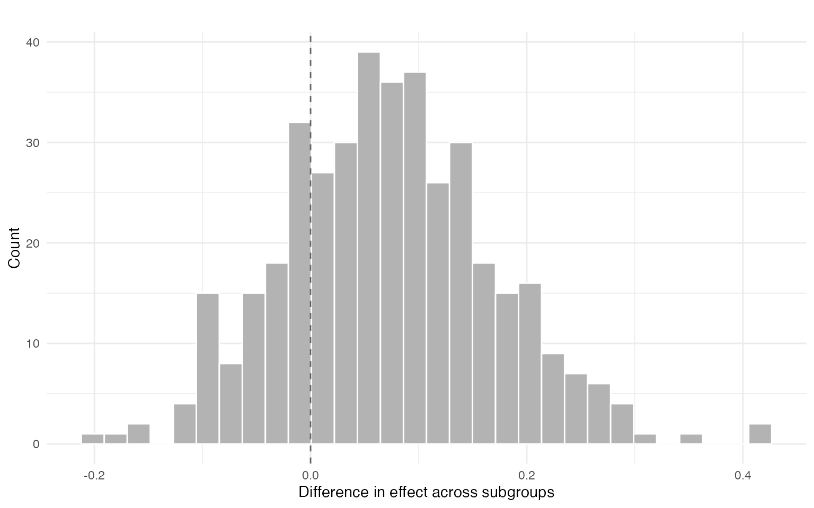
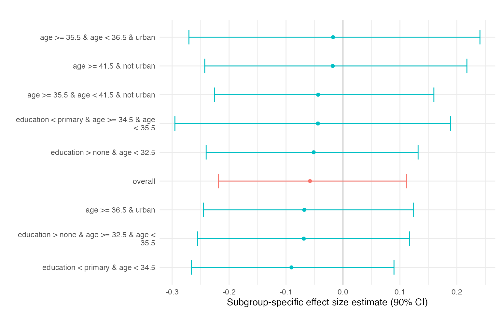

# Prince BART with Ordinal Uptake

## Overview

While earlier vignettes focus on binary treatment uptake, many empirical
applications involve treatments that take multiple ordered values. This
vignette illustrates how `princeBART` can be used when the treatment is
**discrete with more than two levels**, using fertility (number of
children) as a motivating example.

We consider a setting in which:

- **Z**: current infecundity indicator (instrument)
- **W**: number of children ever born (treatment)
- **Y**: employment (outcome)
- **X**: baseline covariates such as age, education, and urban residence

The number of children is a **discrete, non-negative variable with a
finite range** (e.g., 0–8 children in the simulated data below). This
differs from the binary uptake case but fits naturally within the Prince
BART framework.

For binary uptake, the IV estimand can be interpreted as the average
effect of switching from untreated to treated among compliers. With
multivalued uptake, the instrument can shift treatment by different
magnitudes across units. In `princeBART`, the primary ordinal contrast
focuses on units with `W(0) - W(1) = 1`, that is, units whose treatment
is shifted by exactly one unit by the instrument. In this
fertility-style example, the corresponding summary can be interpreted as
the average impact of one additional child on employment for women in
that one-unit-shift principal stratum.

This example is inspired by applications where current infecundity is
used as an instrument for fertility and employment is the outcome of
interest. See the methodological and empirical application in:

<https://arxiv.org/abs/2508.10787>

Conceptually, this vignette combines two ideas illustrated separately in
earlier vignettes:

1.  **Detecting treatment effect heterogeneity** using conditional
    effects among units with a one-unit treatment shift
    (`W(0) - W(1) = 1`).
2.  **Generalizing those conditional effects** to a broader population
    by averaging over a target covariate distribution.

In this example, the target population is defined **within the same
survey dataset**, rather than through a separate external dataset.

## Setup

We observe:

- **Z**: binary instrument
- **W**: ordinal treatment taking values `0, 1, ..., J`
- **Y**: binary outcome
- **X**: baseline covariates

Our goal is to estimate conditional effects for one-unit treatment
changes (`W(0) - W(1) = 1`) and summarize how these effects vary across
values of `X`.

## Identification Assumptions

The analysis relies on standard instrumental-variable assumptions
adapted to the multivalued-treatment setting.

1.  **Conditional unconfoundedness of the instrument given X** After
    adjusting for observed covariates `X`, the instrument `Z` is assumed
    independent of the relevant potential outcomes.

2.  **Exclusion restriction** The instrument affects the outcome only
    through the treatment `W`.

3.  **Monotonicity** In this application, infecundity can only weakly
    reduce fertility, so `W(1) <= W(0)` under the coding where `Z = 1`
    indicates infecundity.

4.  **Additional assumption for multivalued treatments** With
    multivalued treatments, identification additionally requires an
    assumption about the residual association between `W(0)` and `W(1)`
    after conditioning on observed covariates `X`.

## Simulated Example Data

We simulate a dataset inspired by fertility applications where current
infecundity affects the number of children ever born, and an additional
child may reduce employment in a heterogeneous way.

``` r
simulate_ps_ordinal <- function(
  n = 1000,
  max_w = 8,
  seed = 123
) {
  set.seed(seed)

  age <- pmin(pmax(round(rnorm(n, mean = 29, sd = 8)), 18), 45)

  education <- sample(
    c("none", "primary", "secondary+"),
    size = n,
    replace = TRUE,
    prob = c(0.25, 0.30, 0.45)
  )

  urban <- rbinom(n, 1, 0.45)

  sexually_active <- rbinom(
    n, 1,
    plogis(-3 + 0.18 * (age - 18) + 0.5 * urban)
  )

  educ_num <- c("none" = 0, "primary" = 1, "secondary+" = 2)[education]

  pz <- plogis(-6.2 + 0.14 * age + 0.4 * sexually_active - 0.15 * educ_num)
  Z <- rbinom(n, 1, pz)

  latent_w0 <- -1.5 +
    0.18 * (age - 18) +
    0.25 * educ_num -
    0.15 * urban +
    rnorm(n, sd = 1.0)

  W0 <- pmax(0, pmin(max_w, round(latent_w0)))

  delta <- rbinom(
    n, size = 2,
    prob = plogis(-1.3 + 0.15 * W0 + 0.02 * (age - 25))
  )

  W1 <- pmax(0, W0 - delta)

  W <- ifelse(Z == 1, W1, W0)

  tau_child <- ifelse(
    education == "none", -0.2,
    ifelse(education == "primary", -0.1, 0.00)
  )

  eta0 <- -0.7 +
    0.10 * educ_num +
    0.10 * urban +
    0.02 * (age - 25) -
    0.0008 * (age - 25)^2

  eta_y <- eta0 + tau_child * W
  py <- plogis(eta_y)

  Y <- rbinom(n, 1, py)

  data.frame(
    Y = Y,
    Z = Z,
    W = W,
    age = age,
    education = ordered(education,
      levels = c("none", "primary", "secondary+")
    ),
    urban = urban,
    W0_true = W0,
    W1_true = W1,
    pz_true = pz,
    tau_child_true = tau_child
  )
}

set.seed(42)
simdata <- simulate_ps_ordinal(n = 1000, seed = 42)

table(simdata$W)
#> 
#>   0   1   2   3   4   5   6 
#> 483 232 161  82  35   5   2
mean(simdata$Z)
#> [1] 0.161
mean(simdata$Y)
#> [1] 0.383
```

## Basic Usage

### Formula Interface

`princeBART` uses a 2SLS-style formula:

`Y ~ covariates | Z | W`

``` r
library(princeBART)
library(future)
plan(multisession, workers = 4)

fit <- prince_BART(
  Y ~ education + age + urban | Z | W,
  rho = 0,
  data = simdata,
  n_chains = 2,
  n_warmup = 100,
  n_samples = 200,
  instrument_overlap = c(0.1, 0.9),
  keep_trees = TRUE
)

# saveRDS(fit, file = "inst/extdata/fit_ordinal.rds")
```

## Extracting Treatment Effects

`princeBART` summarizes effects among units with a one-unit
instrument-induced treatment shift (`W(0) - W(1) = 1`). These summaries
average conditional effects over the empirical covariate distribution.

``` r
fit <- readRDS(.extdata("fit_ordinal.rds"))

print(fit)
#> Principal Stratification BART Fit
#> ---------------------------------
#> Chains:       2 
#> Iterations:   200 
#> Units:        489 
#> Trees:        saved
#> Uptake model:  Ordinal/count uptake 
#> 
#> Use summary() or coef() to extract contrasts and treatment effects.

summary(fit)
#> Principal Stratification BART Summary (Ordinal Uptake)
#> =====================================================
#> 
#> Type and treated_only parameters are currently 
#>   interpreted in overall contrast computation.
#> 
#> Treatment effects among affected units
#> --------------------------------------
#> 
#> Mixed ATE among affected units:
#>                         variable       mean      median        sd       mad
#> 1 Mixed ATE among affected units -0.0579832 -0.06083325 0.1048113 0.1106534
#>           q5       q95     rhat ess_bulk ess_tail
#> 1 -0.2185254 0.1113679 1.006963 332.8613 333.6813
#> 
#> By treatment level affected by the instrument:
#>    variable        mean      median        sd       mad         q5        q95
#> 1   Level 1 -0.06871285 -0.07054415 0.1056774 0.1122572 -0.2394966 0.09790001
#> 2   Level 2 -0.05358876 -0.06182210 0.1114310 0.1167816 -0.2311257 0.14576060
#> 3   Level 3 -0.05825465 -0.06249365 0.1092862 0.1092012 -0.2442998 0.12043494
#> 4 Level > 3 -0.05061844 -0.05196348 0.1162793 0.1061291 -0.2360216 0.13776173
#>        rhat ess_bulk ess_tail
#> 1 1.0098474 332.9325 366.2210
#> 2 1.0181819 334.1748 284.2230
#> 3 1.0029092 351.1459 364.5359
#> 4 0.9996747 336.9929 313.1013
#> 
#> Levels are shown individually until they cover 80% of affected units;
#>        higher levels are pooled.

coef(fit)
#> Mixed ATE among affected units                        Level 1 
#>                    -0.05798320                    -0.06871285 
#>                        Level 2                        Level 3 
#>                    -0.05358876                    -0.05825465 
#>                      Level > 3 
#>                    -0.05061844
```

## Sensitivity to the multivalued-treatment assumption

With multivalued treatments, identification requires an assumption about
the association between the two potential treatment levels `W(0)` and
`W(1)`. This association is not identified from observed data because
only one of the two potential treatment values is observed for each
individual.

In `princeBART`, this assumption is governed by `rho`, which controls
residual dependence in the latent bivariate uptake model.

- `rho = 0`: conditional independence between latent `W(0)` and `W(1)`
  given `X`
- `rho > 0`: units with higher baseline uptake tend to have higher
  uptake under `Z = 1`
- `rho < 0`: units with higher baseline uptake tend to have lower uptake
  under `Z = 1`

Because `rho` is not empirically identified, varying `rho` is a natural
sensitivity analysis for ordinal-uptake conclusions.

## Effect Heterogeneity by Segments

We can summarize heterogeneity by fitting a shallow regression tree to
the posterior mean conditional effects.

``` r

res <- segment_heterogeneity(
  fit,
  min_compliers_bucket = 2,
  plot = TRUE,
  contrast = TRUE
)

res$contrast$summary
#>         mean         sd    ci_lower  ci_upper  p_gt0
#> 1 0.07251548 0.09698965 -0.08800669 0.2385291 0.7625
res$plot$diff
```



The segment summaries correspond to subgroup-specific averages of
conditional effects. Differences across segments highlight interpretable
heterogeneity in treatment effects.

``` r
res$effects
#>                                         segment    mean    sd ci_lower ci_upper
#>                                         overall -0.0580 0.105   -0.219   0.1114
#>                education < primary & age < 34.5 -0.0905 0.107   -0.266   0.0895
#>  education < primary & age >= 34.5 & age < 35.5 -0.0441 0.149   -0.295   0.1886
#>     education > none & age >= 32.5 & age < 35.5 -0.0689 0.110   -0.255   0.1166
#>                   education > none & age < 32.5 -0.0514 0.113   -0.240   0.1318
#>                             age >= 36.5 & urban -0.0680 0.113   -0.245   0.1240
#>                age >= 35.5 & age < 36.5 & urban -0.0175 0.153   -0.271   0.2405
#>            age >= 35.5 & age < 41.5 & not urban -0.0437 0.120   -0.226   0.1595
#>                         age >= 41.5 & not urban -0.0180 0.137   -0.243   0.2176
#>  p_gt0   n n_group
#>  0.318 489  123.99
#>  0.203  68   16.57
#>  0.399  15    4.20
#>  0.275  87   21.03
#>  0.355 115   24.08
#>  0.258  80   23.39
#>  0.430  17    4.74
#>  0.352  81   22.37
#>  0.463  26    7.61
res$plot$effect
```

 \##
Generalizing to a Broader Population

In earlier vignettes, generalization relied on a separate external
dataset containing the covariate distribution of the target population.
Here we illustrate a related setting where the target population is
defined within the same dataset.

Generalizing treatment effects requires that the conditional effects
estimated in the instrument-identified subgroup are valid for the target
population once we average over the target covariate distribution. This
relies on two conditions: (i) **conditional transportability**, meaning
that after adjusting for the observed covariates (X), the conditional
treatment effects do not differ systematically between the estimation
sample and the target population; and (ii) **adequate overlap** in the
covariate distributions so that the values of (X) observed in the target
population are represented in the estimation sample.

Diagnostics and practical guidance for assessing these conditions are
discussed in the *Generalization with princeBART* vignette.

In this example, the target population is defined using a subpopulation
indicator within the same dataset. The generalization step then averages
the conditional effects estimated by `princeBART` over the covariate
distribution of that target group.

``` r
n <- nrow(simdata)

# Survey design: 100 PSUs with varying sizes
simdata$psu <- sample(1:100, n, replace = TRUE)

# Survey weights
simdata$weight <- runif(n, 0.5, 2)

# Define a target subpopulation (e.g., adults under 60)
simdata$eligible <- simdata$age < 60
```

``` r

# Generalize treatment effects to the target population
pate_result <- general_BART(
  princebart_fit = fit,
  newdata = simdata,
  subpop = simdata$eligible,       # Target subpopulation
  psu = simdata$psu,               # PSU for survey inference
  weights = simdata$weight,        # Survey weights
  n_cores = 4,
  verbose = TRUE
)
#> Computing propensity on common covariates...
#> Step 1: Imputing missing covariates...
#> Step 2: Expanding instrument propensity...
#> Step 3: Predicting potential outcomes...
#> Warning: package ‘future’ was built under R version 4.4.3
#> Warning: package ‘future’ was built under R version 4.4.3
#> Warning: package ‘future’ was built under R version 4.4.3
#> Warning: package ‘future’ was built under R version 4.4.3
#> Step 4: Computing PATE...
#> Done.

# View results
print(pate_result)
#> General BART PATE Estimate
#> ==========================
#> PATE:     -0.0356 
#> 95% CI:  [-0.2105, 0.1923]
#> SD:       0.131 
#> N (subpop): 1000 
#> 
#> Use general_BART_overlap() for overlap analysis
#> Use general_BART_transportability() for sensitivity analysis
```
